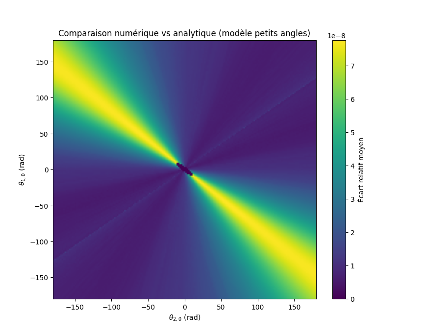

# Pendule Double — Modelisation Numerique

**Projet INSA Lyon** — Modules de Modelisation Numerique

Simulation et analyse d'un **pendule double** — un systeme dynamique non lineaire presentant un comportement chaotique. Resolution numerique des equations du mouvement, quantification du chaos via les exposants de Lyapunov, analyse de bifurcation et visualisations.

---

## Apercus de l'analyse du chaos

### Heatmap des exposants de Lyapunov


Heatmap des exposants de Lyapunov en fonction des angles initiaux θ₁ et θ₂. Les zones rouges indiquent un comportement chaotique (exposant > 0), les zones bleues un comportement regulier.

### Diagramme de bifurcation


Transition ordre → chaos : le diagramme montre comment le systeme passe d'un comportement periodique a un comportement chaotique lorsque les parametres varient.

### Heatmap du temps de retournement


Temps necessaire pour que le pendule se retourne completement, en fonction des conditions initiales. Correlle avec les exposants de Lyapunov.

### Comparaison analytique vs numerique


Comparaison des trajectoires obtenues par resolution analytique (linearisee) et numerique (non lineaire). Le modele linearise diverge rapidement pour les grands angles.

### Ecart relatif entre methodes


Heatmap de l'ecart relatif entre les solutions analytique et numerique, montrant les zones de validite du modele linearise.

---

## Contenu du projet

| Fichier | Description |
|---------|-------------|
| `double_pendulum.ipynb` | Notebook Jupyter principal — simulation complete, analyse et visualisations |
| `Animation *.mp4` | Animations des trajectoires pour differentes conditions initiales |
| `Lyapunov Heatmap *.png` | Heatmaps des exposants de Lyapunov |
| `diagramme de bifurcation legendé.png` | Diagramme de bifurcation annote |
| `Temps de retournement heatmap *.png` | Heatmap du temps de retournement |
| `Ecart relatif heatmap final.png` | Heatmap de l'ecart relatif (comparaison methodes) |
| `Schema expliquation calcul exposant Lyapunov.png` | Explication du calcul des exposants de Lyapunov |
| `pendule double.png` | Schema du systeme pendule double |

## Methodologie

### Resolution des equations differentielles
Les equations du mouvement sont derivees via le **formalisme de Lagrange** et resolues numeriquement avec **scipy.integrate.solve_ivp**. Deux regimes sont compares : non lineaire (equations completes) et linearise (petites oscillations).

### Analyse du chaos
- **Exposants de Lyapunov** — quantification de la sensibilite aux conditions initiales
- **Diagrammes de bifurcation** — transition ordre → chaos
- **Temps de retournement** — metrique de stabilite du systeme
- **Heatmaps parametriques** — influence des masses, longueurs et angles initiaux

## Utilisation

```bash
git clone https://github.com/dean-leveneur/double-pendulum.git
cd double-pendulum
jupyter notebook double_pendulum.ipynb
```

Dependances : Python 3.x, numpy, scipy, matplotlib, sympy

## Resultats cles

1. **Comparaison lineaire vs non lineaire** — le modele linearise diverge rapidement du modele non lineaire pour de grands angles
2. **Exposants de Lyapunov** — mise en evidence des regions chaotiques en fonction des parametres physiques
3. **Diagramme de bifurcation** — visualisation de la transition vers le chaos
4. **Temps de retournement** — correle avec les exposants de Lyapunov pour caracteriser la stabilite

---

*Projet realise a l'INSA Lyon — Modules de Modelisation Numerique*